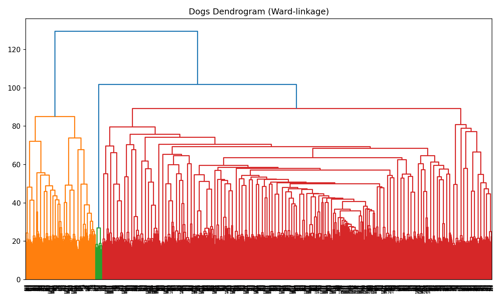

# Assignment: Clustering

## Description

This assignment has **two parts**:

- **Part 1 (MNIST, from scratch):** Implement **K-Means** clustering *from scratch* (no `scikit-learn`, no `scipy`) on a subset of MNIST. Your script must accept the number of clusters as a command-line argument, print the clustering error, and save a file with images reconstructed from each cluster centroid.

- **Part 2 (Dogs SNPs, with packages):** Perform **hierarchical clustering** on the Dogs SNP dataset using standard libraries, print the clustering error, and save a file with a dendrogram representation of the clustering output.

Two environment files are provided: one for **Part 1** (restricted) and one for **Part 2**. You will create two separate python scripts, one for each part.

### Background on MNIST

The MNIST dataset is a widely used image dataset in the engineering and computer science communities. It is publicly available at [The MNIST Database](https://yann.lecun.com/exdb/mnist/).

Each image in the MNIST dataset is a grayscale image of size **28x28 pixels**, resulting in **784** pixels when vectorized into a 1D array. The dataset contains images of handwritten digits from 0 to 9, encompassing 10 distinct classes. Due to its simplicity and the ease of visualizing digits, MNIST is widely used for testing and demonstrating image processing and machine learning techniques.

Although MNIST consists of image data, the unsupervised learning techniques applied in this assignment, such as K-Means and hierarchical clustering, are general-purpose methods. They can be applied to any dataset, including biological datasets, making the skills learned here transferable to many domains.

### Background on Dogs SNP Dataset

In this assignment, the Dogs SNP Dataset provides an additional component where you will work with **genetic data** from dogs. The dataset consists of **784 SNP features** for each of 1355 dog samples, representing variations in their DNA at specific positions in the genome.

The samples are grouped into **clades** (genetically related groups of breeds), provided in `dogs_clades.npy`, which serve as the true labels for clustering evaluation.

---

### Assignment Part 1 (60 points)

1. Use environment `clustering_part1.yaml`.

2. **Load MNIST dataset**:
   - Access provided NumPy arrays `MNIST_X_subset.npy` and `MNIST_y_subset.npy` (use `np.load(<filename>, allow_pickle=True)` to access `.npy` file as a `numpy` array).
     - MNIST_X_subset consists of **6000 images** from the MNIST dataset with **600 images for each digit** (0-9), unwrapped into arrays of 784 pixel values.
     - MNIST_Y_subset contains a list of true digit labels for each image.

3. **Implement K-Means clustering**  
   - **Initialization:**
     - **Random initialization:** pick `k` distinct points uniformly at random from the dataset as initial centroids. 
   - **Iterative updates:**  
     - **Assignment step:** assign each point to the nearest centroid (distance metric: Euclidian).  
     - **Update step:** recompute each centroid.  
   - **Convergence:** stop when either:  
     - a maximum number of iterations is reached (e.g., 300), or  
     - the maximum centroid shift between two consecutive iterations is smaller than a tolerance (e.g., 1e-4).

   *Hint: Use vectorized operations (numpy) whenever possible to keep performance reasonable. My algorithm takes ~15 seconds, depending on the initialization. Yours might take longer, but shouldn't take several minutes.*

4. **Visualize the centroids** of the clusters with `matplotlib.imshow`:
   - Reshape each centroid into the original image format (28x28 pixels, 0-255 pixel values).
   - Save the centroids for each clustering attempt as a single image file.
     - Your program should produce a centroid image file: `centroids_k<k>.png`
     - These files should have image representations of the `k` centroids presented left to right.

5. **Ensure script accepts CLI arguments**
   - `-k` (int, required): number of clusters.  
   - *Hint:* Use `argparse` module for easy configuration.

6. **Compute the clustering error**:
   - For each cluster:
     - Determine the majority **true** digit label.
     - Count the number of samples in the cluster that do **not** match the majority label.
     - Sum these counts across all clusters to obtain the **total clustering error**.
   - Report the clustering error in terms of the **number of misclassified samples.**
   - Print your clustering error to stdout in the following format EXACTLY:
      
      ```
      k=<number of clusters>, ERROR=123
      ```

      Where `123` is the actual error you calculated.


**Execution Commands**:

   ~~~bash
   python Firstname_Lastname_clustering_Part1.py -k 10
   python Firstname_Lastname_clustering_Part1.py -k 11
   ~~~

**Outputs**:
 - Centroid image files: `centroids_k10.png`, `centroids_k11.png` 
 - Error printed to stdout.
 - All images generated for this assignment should be consolidated into a final PDF for submission. 

---

### Assignment Part 2 (40 Points)

**Hierarchical Clustering on Dogs Dataset**

1. Use environment `clustering_part2.yaml`.

2. **Load the Dogs dataset**:
   - `dogs_X.npy`: SNP data of 1355 dog samples, each with 784 SNP features.
   - `dogs_clades.npy`: Clade information for each dog sample.

3. **Perform hierarchical clustering** on the Dogs dataset using `scipy.cluster.hierarchy`.
   - Use Ward linkage method.

4. **Visualize the truncated dendrogram** of the hierarchical clustering (save as `Dogs_dendrogram_truncated.png`)
   
   - The full dendrogram resulting from hierarchical clustering looks like this:

   
   - That's a lot of leaf nodes - one for each of the 1355 dogs!
   - Use `scipy.cluster.hierarchy.dendrogram` to plot a truncated dendrogram with 30 leaf nodes (since there are 30 dog clades represented in the dataset). This is like "cutting" the dendrogram horizontally at the level where 30 clusters remain and collapsing the lower parts of the tree into 30 visible leaves.
   - Label each of the 30 visible leaf nodes with the number of samples in that cluster.
   
5. **Compute the clustering error on the 30 terminal nodes**:

   - *Hint:* Look for a `scipy.cluster.hierarchy` method that assigns samples to clusters, given a maximum number of clusters within the hierarchy.
   - Use the clade information as the true labels.
   - Follow the same error computation method as in Part 1.
   - Print in the format: `k=30, ERROR=123` as in Part 1

**Execution Command**:

    ```
    python Firstname_Lastname_clustering_Part2.py
    ```

**Output**:

- Hierarchical clustering plot (`Dogs_dendrogram_truncated.png`).
- Error printed to stdout.
- All images generated for this assignment should be consolidated into a final PDF for submission. 

---

## Submission

You should turn in the following files to Canvas:
- `Firstname_Lastname_clustering_Part1.py` (runs in Part 1 environment)
- `Firstname_Lastname_clustering_Part2.py` (runs in Part 2 environment)
- `Firstname_Lastname_clustering_images_explanation.pdf`
  
The PDF should contain each of these images in a single file, in addition to your explanation for how you know your solution is correct:
- `centroids_k10.png`
- `centroids_k11.png`
- `Dogs_dendrogram_truncated.png`
- Correctness evaluation explanation, as per the syllabus

