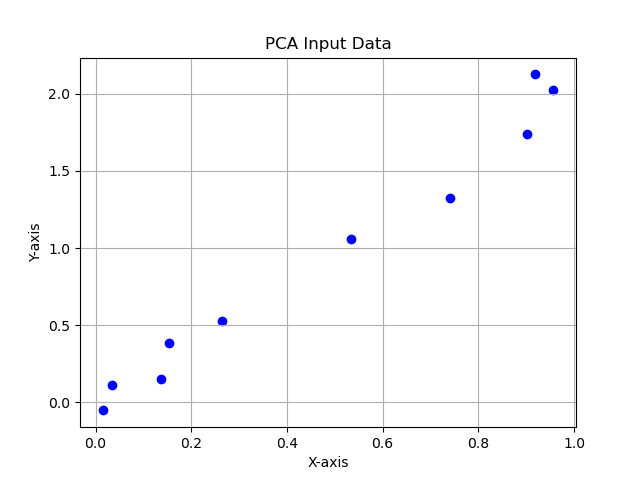

# Assignment: Dimensionality Reduction/PCA

## Description

This assignment focuses on applying dimensionality reduction techniques, specifically Principal Component Analysis (PCA) and Non-Negative Matrix Factorization (NMF), to visualize, reconstruct, and identify patterns in high-dimensional data. It has **three parts**:

- **Part 1 (simple, 2-D dataset):** Work through a tutorial to develop a mathematical intuition of PCA. Your script will print calculated values and the answers to 5 questions to stdout and save one plot image. An example stdout output has been provided. 
- **Part 2 (MNIST dataset)** Visualize the MNIST image dataset in two dimensions using PCA, reconstruct an image from the reduced data, and generate a new image from the reduced data. Your script will save one plot and three images.
- **Part 3 (Dogs SNP dataset)** Use NMF to identify genetic ancestry patterns in dogs. Your script will save a `.tsv` file summarizing the average ancestry components for each dog clade. 

You will turn in three separate python scripts for this assignment, one for each part. All scripts will be run in the same provided environment, `pca_linalg.yaml`.

---

### Assignment

#### Part 1: PCA & Eigendecomposition (40 Points)

**Principal Component Analysis (PCA)** is a statistical technique used to reduce the dimensionality of datasets while preserving as much variance as possible. It achieves this by transforming the original variables into a new set of uncorrelated variables called principal components, ordered by the amount of variance they capture from the data. 

In this part, you will work through a small synthetic 2D dataset that is “mostly 1D” (points lie mostly on a line with a little noise). This will help you build intuition about how PCA works mathematically and how the PCA implemented in `sklearn` is transforming your data. 

For Part 1, you will turn in one figure (`projection_1D.png`) and print values and your answers to 5 questions posed throughout to stdout/console. 

1. **Load `part1_data.npy` as a `numpy` array**:
   
   - `X = np.load('part1_data.npy', allow_pickle=True)`
   - It is useful to think about this dataset as a collection of vectors, each with components $[x_i, y_i]$.

   Here is a plot of the data, for reference:
   
   

2. **Use `sklearn.decomposition.PCA` to do PCA on the dataset**:
   
   Run the following:
   ```
   from sklearn.decomposition import PCA

   pca = PCA(n_components=2)
   pca.fit(X)

   print("Sklearn direction of each PC (PC1, PC2):\n", pca.components_)
   print("Sklearn explained variance for each PC (PC1, PC2):\n", pca.explained_variance_)
   print("Sklearn fraction of variance explained by each PC (PC1, PC2):\n", pca.explained_variance_ratio_)

   x_pca = pca.transform(X)
   print("Sklearn data projection into 1-D (onto PC1):\n", x_pca[:, 0])

   ```

#### Now, let's work through a series of transformations of your starting data, $X$, to see what `sklearn` just did. 

3. **Center the data**:

   - Subtract the mean vector from each vector in your starting dataset, $X_c = X - \mu$.
  
4. **Calculate the covariance matrix for the centered data**:

   - Calculate covariance matrix, $\Sigma = \frac{1}{n-1}X_c^\top X_c$, where $n$ is the number of points

   Example:
   ```
   sigma = (Xc.T @ Xc) / (n - 1)
   ```
   **Print your covariance matrix** and observe that it is in the form: 
   <table>
   <tr>
      <td>Cov(x, x)</td>
      <td>Cov(x, y)</td>

   </tr>
   <tr>
      <td>Cov(y, x)</td>
      <td>Cov(y, y)</td>
   </tr>
   </table>

   - The matrix is always square and symmetric across the diagonal. Here it has shape 2 x 2 because our data has two dimensions/variables ($x$ and $y$). 
     - Each diagonal entry represents the variance in $x$ and $y$, respectively. In the plot of the original data, notice there is more variance/spread in the $y$ direction than in the $x$ direction, so Cov$(y, y) >$ Cov$(x, x)$. 
     - The off-diagonals represent the correlation between variables. In this example, we expect a positive value since we can clearly see that there is a positive correlation between $x$ and $y$ in the original data. 

5. **Perform eigendecomposition on the covariance matrix**:

   Many matrices can be broken down into products of simpler matrices, vectors, and/or scalars. These decompositions reveal useful properties about the original matrix. Here, we will use eigendecomposition, which expresses a square matrix in terms of characteristic scalars (eigenvalues, $\lambda$) with corresponding directions (eigenvectors, $v$). 

   Specifically, use `np.linalg` to solve for combinations of $\lambda$ (scalars) and $v$ (vectors) that make this equation true, where $\Sigma$ is the covariance matrix:

   $$
   \Sigma v = \lambda v
   $$

   Example:
   ```
   eigenvals, eigenvecs = np.linalg.eigh(sigma)
   # Note: each column of eigenvecs is an eigenvector
   ```
   - We call the largest eigenvalue $\lambda_1$ with corresponding eigenvector $v_1$, the second largest eigenvalue is $\lambda_2$ with eigenvector $v_2$, etc...
   - **Print $\lambda_1$, $v_1$, $\lambda_2$, $v_2$**
   - **Question 1**: Compare your results to the `sklearn` output. What do you notice?
   - **Question 2**: Look at the plot of the original data. What do you expect is the direction of greatest variance? Do you see this represented in $v_1$?

6. **Calculate the ratio of each eigenvalue**
   $$
   \frac{\lambda_1}{\lambda_1 + \lambda_2} \space and \space \frac{\lambda_2}{\lambda_1 + \lambda_2}
   $$
   - **Print $\lambda_1$_ratio, $\lambda_2$_ratio**
   - **Question 3**: Compare your results to the `sklearn` output. What do you notice? 

7. **Project data onto $v_1$**:
   - Take the dot product $X_c \cdot v_1$.
   - Intuitively, this tells us "how far along" each point in our dataset falls along a line with direction $v_1$.
   
   Example:
   ```
   projection = Xc @ v_1
   ```
   - **Question 4**: Print `projection` and compare your results to the `sklearn` output. What do you notice?


8. **Plot `projection` as points on a number line**:
   - Save plot as `projection_1D.png`
   - **Question 5**: How does this plot compare to your starting results? What looks the same? What looks different?

**Execution Command**:

   ~~~bash
   python Firstname_Lastname_pca_linalg_part1.py
   ~~~

**Outputs**:
 - 1D projection plot: `projection_1D.png`
 - Tutorial values and answers printed to stdout (see example).
 - All images generated for this assignment should be consolidated into a final PDF for submission. 

---

#### Part 2: PCA on MNIST Dataset (60 Points)

1. **Load the MNIST subset**:

   - Use the same MNIST subset provided in the previous assignment (`MNIST_X_subset.npy` and `MNIST_y_subset.npy`).
   - This subset consists of **6000 images** from the MNIST dataset, with **600 images for each digit** (0-9).

2. **Perform PCA to reduce dimensions to 2**:

   - Apply PCA to reduce the data from **784 dimensions** to **2 dimensions**.
   - Store the transformed data for visualization.

3. **Visualize the 2D PCA-transformed data**:

   - Create a scatter plot of the transformed data.
   - Color-code the points based on their actual digit labels.
   - Save the plot as `MNIST_PCA_2D.png`.

4. **Reconstruct an image using the first 2 principal components**:

   - Take the first example (index 0) from the dataset.
   - Project it onto the first 2 principal components to obtain its reduced representation.
   - Reconstruct the image from this reduced representation back to the original **784-dimensional** space (use `inverse_transform`).
   - Visualize and save the reconstructed image as `MNIST_reconstructed_2PC.png` (use `matplotlib.imshow`).
   - Also, visualize and save the original image as `MNIST_original.png` for comparison.

5. **Reconstruct an image from a selected 2D point**:

   - Observing the 2D plot obtained in the previous step, manually choose the 2D coordinates of a location (not a data point) in the PCA-transformed space to visualize an image that resembles the digit 1.
   - Use the PCA model to reconstruct this point back to the original **784-dimensional** space.
   - Visualize and save the reconstructed image as `MNIST_reconstructed_1_from_coord.png`. You have just generated a new handwritten-like 1. This is a form of generative AI.


**Execution Command**:

   ~~~bash
   python Firstname_Lastname_pca_linalg_part2.py
   ~~~

**Outputs**:
 - PCA plot: `MNIST_PCA_2D.png`
 - 3 images: `MNIST_reconstructed_2PC.png`, `MNIST_original.png`, `MNIST_reconstructed_1_from_coord.png`
 - All images generated for this assignment should be consolidated into a final PDF for submission. 

---

#### Part 3: Non-Negative Matrix Factorization on Dogs Dataset

**Non-Negative Matrix Factorization (NMF)** is a dimensionality reduction technique that factors a non-negative matrix into two non-negative matrices. Unlike PCA, NMF results in additive, non-negative components, which can lead to more interpretable parts-based representations. While PCA relies on eigen-decomposition of a covariance matrix, NMF relies on a different kind of matrix factorization, but both approaches reduce complex data into a smaller set of building blocks that capture key patterns.

In practice, we start with a data matrix $X \in \mathbb{R}^{m \times d}$, where $m$ is the number of samples and $d$ is the number of features. NMF approximates this as

$$
X \approx W H
$$

with the following dimensions:

- $W \in \mathbb{R}^{m \times n}$ — describes how much each of the $n$ components contributes to each sample  
- $H \in \mathbb{R}^{n \times d}$ — describes the $n$ components themselves in terms of the original features  

Multiplying these together gives

$$
(m \times n) \cdot (n \times d) = (m \times d),
$$

so the product $WH$ matches the shape of the original data.

The number of components $n$ is chosen by you, and it controls the "resolution" of the factorization. A small $n$ forces the model to explain the data with just a few broad building blocks, while a larger $n$ allows for more detailed patterns.

1. **Load the Dogs dataset**:

   - Use the same Dogs dataset (`dogs_X.npy`, `dogs_clades.npy`) as prior assignments. It contains **1355 dogs × 784 SNPs** and **30 clades**.

2. **Factor the data into $W$ and $H$ with 5 ancestry components**:

   - *Hint*: Use `sklearn.decomposition.NMF` 
   - **Normalize rows of $W$ to proportions** so each individual’s components sum to 1.

3. **Save a summary of your results by clade**:
   
   - **Average the normalized $W$ across all dogs within each clade** to obtain mean ancestry fractions per clade.

   **Required `dogs_ancestry_summary.tsv` format:**
   - Sort rows **alphabetically by clade name** (*–Z).
   - Label and order ancestry columns by prevalence across all **clades** (so each clade is given equal weight, not individual dogs).
     - most common = `ancestry1`, …, least = `ancestry5`
   - Round each ancestry fraction to **two decimals**.
   
   ```
   clade    ancestry1   ancestry2    ancestry3   ancestry4   ancestry5
   **Basenji   0.XX  0.XX  0.XX  0.XX  0.XX
   **Eurasier  0.XX  0.XX  0.XX  0.XX  0.XX
   ...
   Wolf  0.XX  0.XX  0.XX  0.XX  0.XX
   ```
   - Match this format **exactly** to receive full credit. 

**Execution Command**:

    ```bash
    python Firstname_Lastname_pca_linalg_part3.py
    ```

**Outputs**:
- Dogs ancestry summary table: `dogs_ancestry_summary.tsv`

---

## Submission Requirements

You should turn in the following files to Canvas:

- `Firstname_Lastname_pca_linalg_part1.py`

- `Firstname_Lastname_pca_linalg_part2.py`

- `Firstname_Lastname_pca_linalg_part3.py`

- `Firstname_Lastname_pca_linalg_images_explanation.pdf`

All scripts must run in the provided environment, `pca_linalg.yaml`.

The PDF should contain each of these images in a single file, in addition to your explanation for how you know your solution is correct:

- `projection_1D.png`

- `MNIST_PCA_2D.png`
  
- `MNIST_reconstructed_2PC.png`
  
- `MNIST_original.png`
  
- `MNIST_reconstructed_1_from_coord.png`

- Correctness evaluation explanation, as per the syllabus